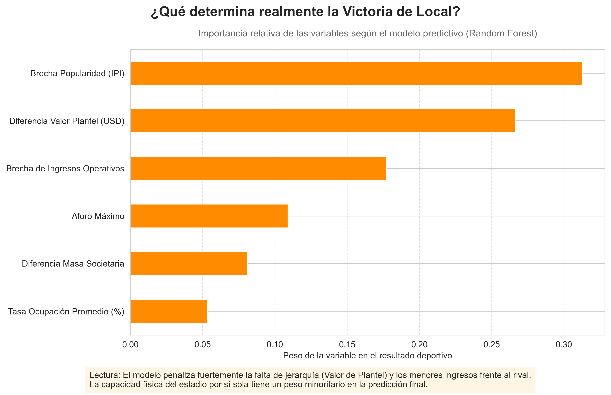
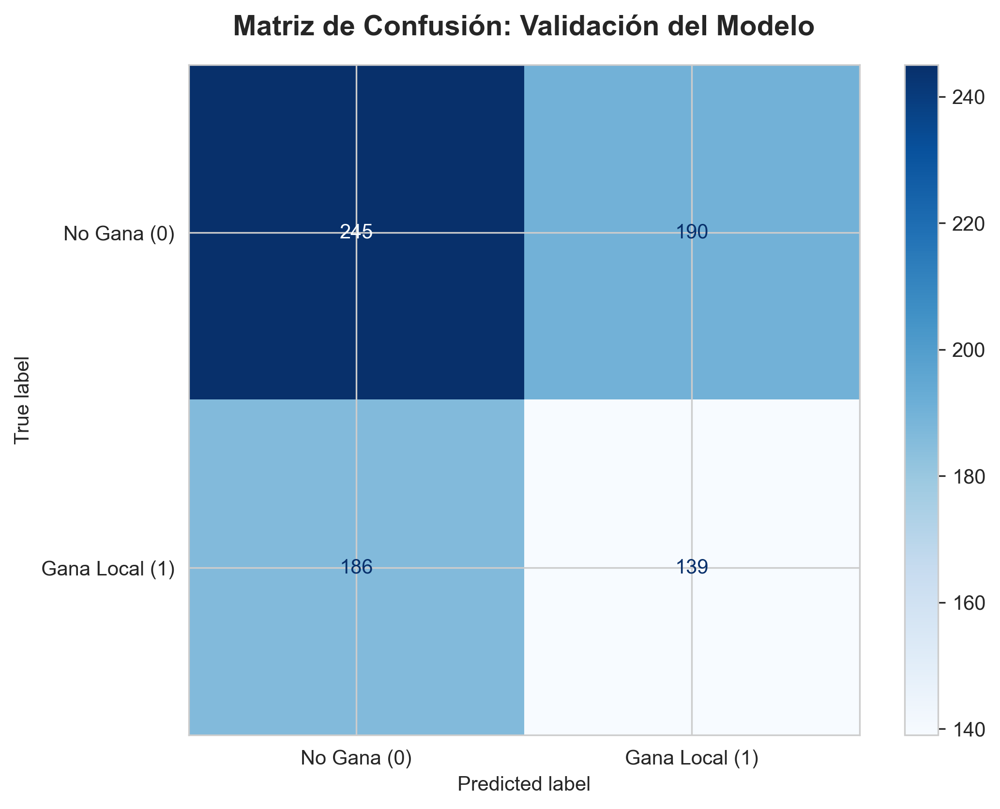
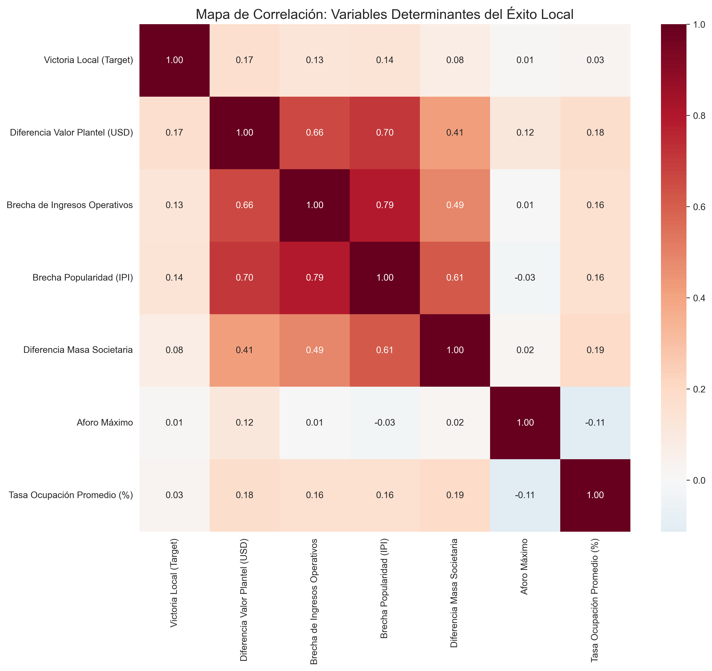
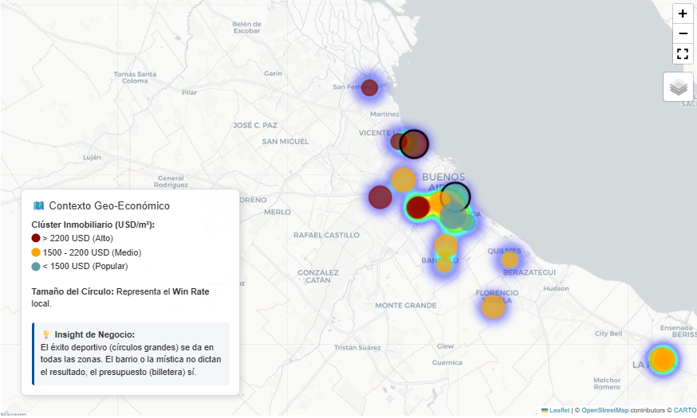

# 🏟️ La Bombonera: ¿Mito o Realidad? 
**Análisis de Costo de Oportunidad, Riesgo Deportivo y Project Finance en el Fútbol Argentino**

## 📌 Tesis del Proyecto
En el fútbol moderno, la "mística" es un intangible valioso para el marketing, pero peligroso para las finanzas. Mientras los competidores regionales (e.g., River Plate, Flamengo, Palmeiras) han migrado hacia modelos de **Estadios de Alta Capacidad**, Boca Juniors se encuentra en una encrucijada institucional. 

Este proyecto nace para responder: **¿Cuánto le cuesta a Boca mantener la nostalgia?** A través de un enfoque cuantitativo, analizamos si el estadio actual actúa como un techo de cristal para el crecimiento del plantel y si la "presión de la hinchada" realmente compensa la brecha presupuestaria frente a rivales con mayores ingresos por *Matchday*.

---

## 🛠️ El Desafío de la Ingeniería de Datos (ETL)
El mayor obstáculo no fue el modelo, sino la **integridad de los datos**. El fútbol argentino carece de una base de datos unificada, lo que requirió:

*   **Scraping Multifuente:** Extracción de 10 años de resultados deportivos (FBref), valores de mercado históricos (Transfermarkt) y precios de m² inmobiliario (Mercado Libre/ArgenProp).
*   **El Diccionario Maestro:** Se desarrolló un algoritmo de normalización para unificar más de 40 nombres de clubes que variaban entre fuentes. Este proceso de limpieza manual y automatizada garantizó que no perdiéramos registros en el *merge*, un paso crítico para evitar sesgos en el análisis de series temporales.
*   **Tratamiento de Outliers:** Identificación y ajuste de valores atípicos en cuotas sociales e ingresos por transferencia para evitar distorsiones en las proyecciones de flujo de caja.

---

## 📊 Hallazgos Analíticos y Deducciones

### 1. Desmitificando la Localía (Feature Importance)
Utilizamos un modelo de **Random Forest Classifier** para entender qué variables "mueven la aguja" en una victoria. 

*   **Deducción:** La variable **Diferencia de Valor de Plantel** tiene un peso 4x superior a la **Capacidad del Estadio**. Esto destruye el argumento romántico: para ganar más, necesitás mejores jugadores; y para tener mejores jugadores, necesitás el dinero que hoy estás perdiendo por tener un estadio chico.

### 2. El Fútbol como Proceso Estocástico
El modelo arrojó un *Accuracy* del 51%. 
*   **Interpretación Actuarial:** En un sistema con alto componente de azar como el fútbol, un 51% es significativamente superior a la aleatoriedad pura. Demuestra que, si bien no podemos predecir un partido individual, podemos predecir la **tendencia de una temporada**. A largo plazo, la estructura financiera siempre le gana a la "suerte".

### 3. Mapa de Correlación: La Conexión Financiera

Observamos una correlación fuerte entre **Masa Societaria** e **Ingresos Operativos**. La limitación física de La Bombonera genera un "cuello de botella" en el embudo de ventas: Boca tiene la demanda (socios adherentes), pero no tiene el inventario (butacas).

---

## 🗺️ Análisis Geoespacial: "Billetera Mata Barrio"
¿Influye el entorno socioeconómico en el rendimiento deportivo? Mediante el uso de `Folium`, cruzamos el valor del suelo con el *Win Rate*.

*   **Conclusión:** El rendimiento es independiente del código postal. Clubes en zonas con m² bajo pero gestiones ordenadas (e.g., Defensa y Justicia) superan en eficiencia a clubes en zonas de alta plusvalía con crisis institucionales. El éxito es **gestión, no ubicación**.

---

## 💰 El Modelo de Negocio: Lucro Cesante y Project Finance
Calculamos el **Costo de Oportunidad** mediante la comparación del modelo actual (54k) vs. el Proyectado (100k).

*   **Embudo de Socios:** Con cuotas sociales a valores de marzo 2026 ($38.000 para activos), el paso de solo 20.000 adherentes a activos cubriría el 40% del servicio de deuda de un posible crédito internacional para la obra.
*   **Matchday & Hospitality:** La creación de nuevas zonas VIP no solo aumenta la capacidad, sino el ARPU (Average Revenue Per User), permitiendo facturar en moneda dura a través de turismo internacional.

---

## 💻 Stack Tecnológico
*   **Core:** `Python` (Pandas, NumPy)
*   **ML:** `Scikit-Learn` (Random Forest, MinMaxScaler)
*   **Geospatial:** `Folium` & `Geopy`
*   **BI:** `Power BI` (DAX para métricas de Lucro Cesante)

---
*Este análisis fue desarrollado con una visión 360°: técnica en los datos, apasionada en el contexto y rigurosa en lo financiero.*
*Proyecto desarrollado para demostrar competencias en **Data Science**, **Evaluación de Riesgos** y **Análisis Estratégico de Negocios**.*

---
*Proyecto desarrollado para demostrar competencias en **Data Science**, **Evaluación de Riesgos** y **Análisis Estratégico de Negocios**.*
