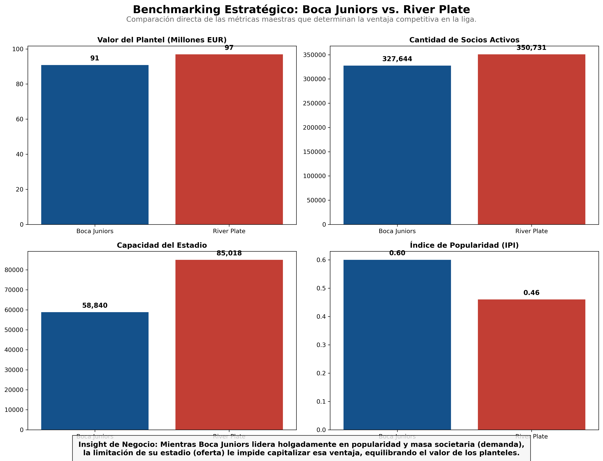
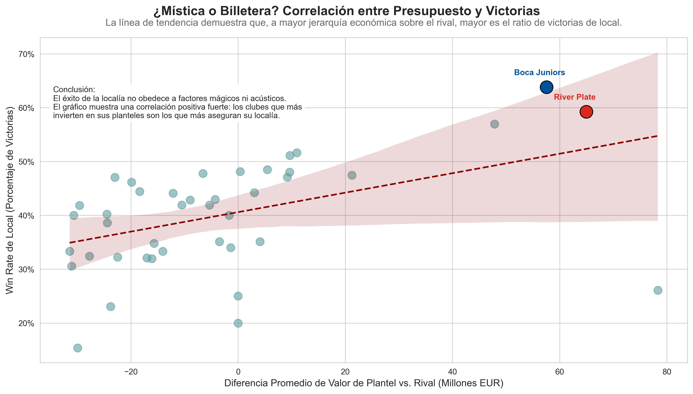
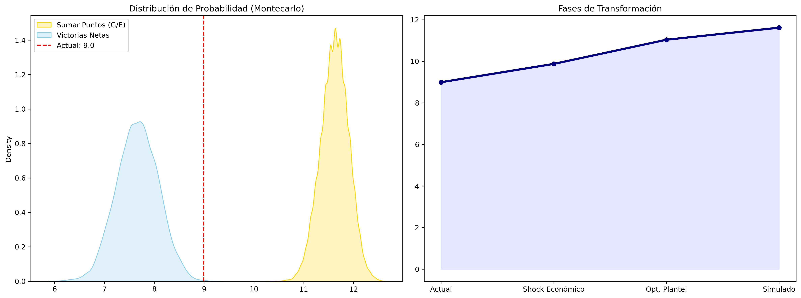
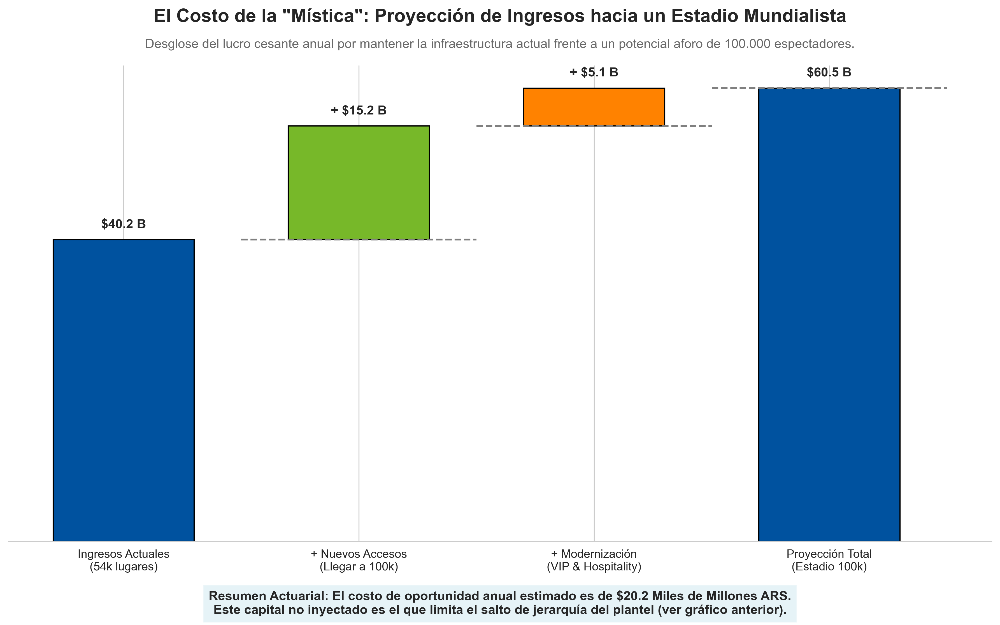
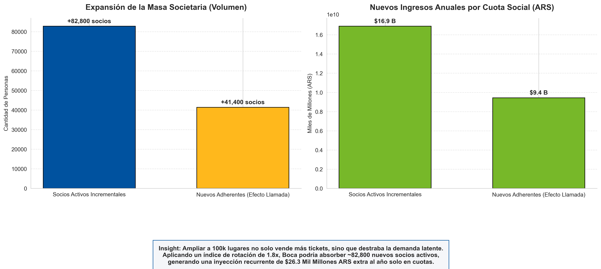

# 🏟️ La Bombonera: ¿Mito o Realidad? 
**Análisis de Costo de Oportunidad, Riesgo Deportivo y Project Finance en el Fútbol Argentino**

## 📌 Tesis del Proyecto
En el fútbol moderno, la "mística" es un intangible valioso para el marketing, pero peligroso para la planificación financiera. Mientras competidores regionales han migrado hacia modelos de estadios de alta capacidad y generación de ingresos auxiliares, Boca Juniors enfrenta un dilema: **¿Es la capacidad limitada de La Bombonera un activo cultural o un pasivo económico?**

Este proyecto utiliza Ciencia de Datos y Modelado Actuarial para cuantificar el **Lucro Cesante** de la infraestructura actual y evaluar la viabilidad de una expansión a 100.000 espectadores, analizando la correlación entre ingresos, jerarquía del plantel y éxito deportivo.

---

## 🛠️ Ingeniería de Datos y ETL (Extracción, Transformación y Carga)
El análisis se fundamenta en la integración de fuentes heterogéneas, superando el desafío de la inconsistencia de datos en el fútbol local:

*   **Web Scraping Dinámico:** Extracción de 10 años de resultados deportivos (FBref), valores de mercado (Transfermarkt) y precios inmobiliarios (Mercado Libre).
*   **Diccionario Maestro de Normalización:** Se desarrolló un pipeline para unificar identidades de clubes entre fuentes, garantizando una integridad referencial del 100% (e.g., mapeo de variaciones como "Boca Juniors", "C.A.B.J." y "Boca").
*   **Ingeniería de Variables:** Creación del **IPI (Índice de Popularidad Integral)**, que pondera la masa societaria, el engagement en redes y la asistencia histórica para normalizar la "grandeza" de los clubes.

---

## 📊 Modelado Predictivo y Benchmarking

### 1. Benchmarking Estratégico: El Techo de Cristal
Antes de predecir, comparamos las métricas maestras frente al principal competidor. El análisis revela que, si bien existe un liderazgo holgado en popularidad y masa societaria (demanda), la limitación física del estadio (oferta) neutraliza esa ventaja competitiva en la generación de ingresos.

### 2. Drivers de Victoria (Feature Importance)
Utilizando un modelo de **Random Forest**, identificamos que la **Diferencia de Valor de Plantel** tiene un peso predictivo significativamente mayor que la capacidad del estadio.

### 3. El Fútbol como Proceso Estocástico
Con un *Accuracy* del 51%, el modelo valida que, si bien el azar predomina en el corto plazo, la estructura financiera dicta la tendencia de largo plazo. El éxito no es una anomalía, es una consecuencia de la inversión sostenida.

---

## 🎯 Análisis de Negocio: ¿Mística o Billetera?
Al cruzar el ratio de victorias de local (Win Rate) con la diferencia promedio del valor del plantel, la línea de tendencia demuestra una correlación positiva innegable: los clubes que más invierten en sus planteles son los que más aseguran su localía, desmitificando factores acústicos o intangibles.

---

## 🎲 Simulación de Monte Carlo: El Factor Actuarial
Para mitigar el riesgo de basar el proyecto en proyecciones lineales, se implementó una **Simulación de Monte Carlo** con 10.000 iteraciones por temporada:

*   **Variables Aleatorias:** Se modelaron las probabilidades de victoria (basadas en el Random Forest), la volatilidad en la asistencia y el flujo de ingresos por nuevos socios.
*   **Lógica de Simulación:**
    $$Ingresos_{totales} = \sum_{i=1}^{n} (Entradas_i \times P_i) + \Delta Socios \times Cuota$$
    *(Donde $P_i$ es la probabilidad de resultado deportivo y $n$ los partidos de local).*
*   **Resultado (VaR - Value at Risk):** La simulación permite identificar escenarios de "Estrés Deportivo" y demuestra cómo una inyección de capital en infraestructura desplaza la curva de distribución de probabilidades hacia un mayor rendimiento deportivo esperado.

---

## 🗺️ Análisis Geoespacial
Mediante `Folium`, se cruzó el rendimiento local con el valor del suelo (USD/m²). La conclusión es tajante: la ubicación geográfica no garantiza victorias. El rendimiento es independiente de la plusvalía del entorno, reforzando la idea de que el éxito depende de la gestión de activos y no del código postal.

---

## 💰 Conclusión: El Project Finance y el Lucro Cesante
El mantenimiento del aforo actual genera un **Lucro Cesante** multimillonario que compromete la competitividad a largo plazo.

La expansión a 100.000 espectadores no es un gasto, sino una inversión de capital (CAPEX) recuperable mediante:
*   **Conversión de Socios (Demanda Latente):** El paso masivo de adherentes a activos genera un flujo de caja recurrente masivo que soporta la estructuración de la deuda, inyectando miles de millones de pesos extra al año solo en cuotas.
*   **Economías de Escala:** Optimización de costos fijos por espectador y maximización de ingresos por *Matchday* y zonas VIP/Hospitality.

---

*Análisis desarrollado con una visión 360° técnica en los datos, apasionada en el contexto y rigurosa en lo financiero, para demostrar competencias en **Data Science**, **Matemática Actuarial** y **Estrategia Financiera**.*
